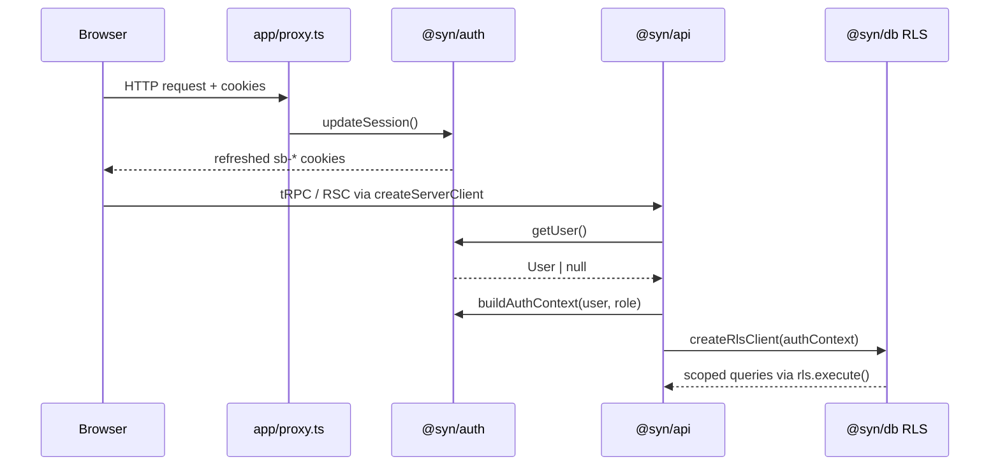

# Authentication

How Synapse handles identity, sessions, and the bridge into Postgres RLS across the monorepo.

**Related docs:** [database-setup.md](./database-setup.md) · [rls.md](./rls.md) · [codebase-conventions.md](../architecture/codebase-conventions.md) §4.4, §6.3 · [`packages/auth`](../../packages/auth)

---

## Overview

Authentication is **Supabase Auth** wrapped by **`@syn/auth`**. Apps never talk to Supabase directly for server-side auth — they use the shared factories and helpers. Authorization for app data flows through:

```
proxy.ts (session refresh)
  → createServerClient + getUser
    → @syn/api createContext
      → buildAuthContext
        → @syn/db createRlsClient (RLS)
```

**Identity provider:** Supabase Auth (email magic link, password, Google OAuth via shared `AuthCapturePanel`).

**Session storage:** HTTP cookies (`sb-<project-ref>-*`).

**Not yet live everywhere:** `@syn/auth` source files are marked `EXAMPLE — not wired` as a go-live guard when env is missing. **`apps/web` is the reference implementation** for a fully wired app.

---

## `@syn/auth` (`packages/auth`)

Canonical auth package. May import `@syn/db`, `@syn/types`, `@syn/utils`. Must **not** import `api`, `ai`, `hooks`, or `ui`.

### Public API

| Export | Purpose |
|--------|---------|
| `createBrowserClient()` | Env-resolving browser client; server-side only in practice (see below) |
| `createBrowserClientFromCredentials(creds)` | The browser client from credentials the app read as literals; `@syn/auth/browser`, client-safe |
| `AuthUser` / `AuthClient` | The signed-in person and the client, under this package's names; callers never import `@supabase/*` |
| `createServerClient(cookies)` | Cookie-bound server client (RSC, route handlers, server actions) |
| `updateSession(request)` | Session refresh for app `proxy.ts` |
| `getSession(client)` / `getUser(client)` | Server-side session reads; **prefer `getUser`** for authz |
| `buildAuthContext(user, appRole)` | Maps Supabase `User` → `AuthContext` for RLS |
| `buildServiceRoleAuthContext(userId)` | Explicit RLS bypass for webhooks/admin paths only |
| `buildSupabaseEnvForNextConfig()` | Collapses tier-specific env vars in `next.config.ts` |
| `mapAuthError(error)` | Supabase errors → calm user-facing copy |

### The vendor stays in this package (hard rule)

Only `@syn/auth` imports `@supabase/*`: `lint:boundaries` fails anywhere else (`RESTRICTED_EXTERNAL` in `packages/config/eslint/boundaries.js`). The one named exception is `packages/db/scripts/seed-users.ts`, the local auth mirror's seeder; a mason and a warden reviewer glob reach it. `toolkit.json`'s `stack.auth` entry lists what the module owns, `yarn check-stack` keeps it whole, and [`remove-supabase-auth.md`](remove-supabase-auth.md) is how it would go.

### Client / server split (hard rule)

- **`browser.ts`** — the browser client from passed-in credentials; reached as `@syn/auth/browser`.
- **`client.ts`** — browser only; never import from server code.
- **`server.ts`** — cookie-bound; never import from `'use client'` components.
- **`middleware.ts`** — `updateSession` only; consumed by app `proxy.ts`.

Violating this boundary can leak cookie APIs into client bundles.

### Environment & tiers

Auth tier follows **`DATABASE_ENVIRONMENT`** (same rule as Postgres):

| Tier | Supabase Auth project |
|------|------------------------|
| `local` | Staging (`*_STAGING` vars) |
| `staging` | Staging (`*_STAGING` vars) |
| `production` | Production (unprefixed vars) |

Required vars (see root [`.env.example`](../../.env.example)):

```bash
# Staging (local + staging tiers)
NEXT_PUBLIC_SUPABASE_URL_STAGING=
NEXT_PUBLIC_SUPABASE_ANON_KEY_STAGING=   # or PUBLISHABLE_KEY_STAGING
SUPABASE_SERVICE_ROLE_KEY_STAGING=

# Production
NEXT_PUBLIC_SUPABASE_URL=
NEXT_PUBLIC_SUPABASE_ANON_KEY=
SUPABASE_SERVICE_ROLE_KEY=
```

Apps collapse tier vars at build time:

```ts
// apps/<app>/next.config.ts
import { buildSupabaseEnvForNextConfig } from "@syn/auth";

env: { ...buildSupabaseEnvForNextConfig(process.env) }
```

Runtime code then reads canonical names (`NEXT_PUBLIC_SUPABASE_URL`, etc.).

### Session refresh (`updateSession`)

Called from each app's **`proxy.ts`** (Next.js 16 — **not** `middleware.ts`).

- Refreshes the JWT via `supabase.auth.getUser()`
- Writes updated cookies on the response
- Purges `sb-*` cookies from **other** Supabase projects when switching tiers/envs

**`updateSession` does not protect routes.** Route guards live in layouts, server actions, or tRPC procedures.

### `AuthContext` & RLS bridge

`AuthContext` is defined in **`@syn/types`**:

```ts
interface AuthContext {
  userId: string;
  role: "guest" | "admin" | "super_admin" | "service_role";
}
```

`buildAuthContext()` maps a Supabase user + `public.users.role` into that shape. `@syn/api` `createContext()` calls it and passes the result to `@syn/db` `createRlsClient()`.

App roles come from **`public.users.role`** (`guest` default). See [rls.md](./rls.md) for policy patterns.

### Local dev: auth vs Postgres

**Auth and Postgres are independent in local dev:**

- **Postgres:** local (`LOCAL_DATABASE_URL`)
- **Auth:** staging Supabase project

On first authenticated request, `ensureLocalUserFromSupabaseAuth()` (in `@syn/db`) inserts a stub `auth.users` row so `public.users` FK constraints resolve. On hosted Supabase, signup triggers handle this automatically.

---

## Request flow (authenticated data access)



### tRPC enforcement

- **`publicProcedure`** — no auth required
- **`protectedProcedure`** — requires `ctx.authContext` and `ctx.rls`; throws `UNAUTHORIZED` otherwise

Apps assemble context by passing a cookie-bound `createServerClient` into `@syn/api` `createContext()`.

### Route handlers that must stay HTTP

Per conventions §3.5 — not tRPC:

- `app/auth/callback/route.ts` — OAuth PKCE code exchange
- `app/auth/confirm/route.ts` — email-link `token_hash` verification (`verifyOtp`). The Supabase email templates link here (`?next=…&token_hash=…&type=…`); the route sets the session on the redirect response so the user lands on `next` already signed in, from any browser. Template source of record + dashboard steps: [supabase-auth-email-setup.md](./environments.md).
- `app/logout/route.ts` — sign-out + cookie cleanup
- Stripe webhooks, data-export downloads, streaming AI routes

Both apps ship both auth routes; the shared response plumbing lives in each app's `lib/auth/auth-redirect-response.ts`. Every `emailRedirectTo` in the codebase targets `/auth/confirm`; OAuth `redirectTo` targets `/auth/callback`.

### Password reset

Entry is the shared `AuthCapturePanel`, so every sign-in surface gets it at once: a "Forgot your password?" link under the password field (sign-in tab only) plus an inline offer appended to the invalid-credentials error. Both call `resetPasswordForEmail` with `redirectTo` = `<origin>/auth/confirm?next=<reset path>?next=<destination>` — nested one level because the confirm route verifies the token, then forwards to the form.

The panel then holds in its await-email phase with `awaitEmailKind: 'passwordReset'`; auto-advance on `SIGNED_IN` is deliberately suppressed for that kind, since the link opens the reset form in another tab and advancing here would navigate the user away mid-entry.

`/reset-password` exists in both apps (web under `(onboarding)`, marketing under `(site)`) and renders the shared `PasswordResetForm` from `@syn/ui/password-reset`. Reaching it without a session means an expired or reused link — the page redirects to that app's login with `auth=link_expired`. Saving calls `updateUser({ password })` and then `signOut({ scope: 'others' })`: a reset often means the account may be compromised, so every other session is revoked while the current one continues.

### Change email

Lives in web Settings → Account, directly beneath the password section — resting state shows the current address with a "Change email" link; submitting calls `supabase.auth.updateUser({ email }, { emailRedirectTo })` targeting `/auth/confirm?next=<settings account route>` and moves the section into a pending state ("Waiting on confirmation for…").

**Supabase's "Secure email change" must be ON** (staging + production) — with it on, both the old and new address must independently confirm before the change takes effect, which is the anti-takeover control for this surface (there is deliberately no current-password gate: OAuth and magic-link users have no password to type). This is dashboard config, not code — treat it as load-bearing the same way VER-1's "Confirm email" setting is.

The pending state is read from `user.new_email` on the server (survives a reload) with the just-submitted value as a client-side bridge until the next refresh. There is no cancel — Supabase has none, and a fake one would lie; requesting a different address simply supersedes the pending one.

**The `public.users` shadow column is a signup-time snapshot, not a live mirror.** `handle_new_user()` only fires `after insert` on `auth.users`; nothing updated it before migration `0086_sync_user_email_from_auth.sql` added a companion `after update of email, phone` trigger (`handle_user_email_sync()`, same file group in `packages/db/supabase/setup/`). Any code that needs a user's *current* email must read it from the auth session (`getUser(supabase).user.email`, or `ctx.user.email` in a tRPC context) — never `db.query.users…email` — unless it's specifically reading the historical/display shadow after the sync trigger is confirmed live. The partner-seat claim match (`getClaimOffer`, `claimSeatByEmailMatch` in `packages/api/src/services/couple/pairing.ts`) takes a `verifiedEmail(ctx.user)` argument for exactly this reason: the gate and the match must be the same value, sourced from the same place, or a confirmed email change can desync who a seat is offered to from who actually controls the invited address.

---

## Per-app

### `apps/web` — wired (reference app)

Marketing uses auth for **member sign-in** (`/login`) and **admin CMS** (`/admin/*`). Product routes live in `tools`; marketing reads entitlements but does not own them.

#### Session refresh

[`apps/web/proxy.ts`](../../apps/web/proxy.ts) calls `updateSession` on all matched routes **except**:

- `/logout`
- `/auth/*` (callback must set cookies without refresh interference)
- `/api/webhooks/*`

#### Auth routes

| Route | Purpose |
|-------|---------|
| `GET /auth/callback` | Exchanges `?code=` for session; redirects to `?next=` (open-redirect safe) |
| `GET /logout` | Signs out, deletes all `sb-*` cookies, redirects `/` |
| `GET /auth/clear` | Recovery when cookies are stale/oversized (HTTP 431); redirects to `/admin/login` |

#### Login surfaces

| Surface | Path | Auth UI | Post-auth check |
|---------|------|---------|-----------------|
| Member login | `/login` | `@syn/ui` `AuthCapturePanel` (Google, magic link, password) | `checkMembership()` → entitlement row |
| Admin login | `/admin/login` | Same panel | `checkAdminAccess()` → `users.role IN (admin, super_admin)` |

Both use `/auth/callback` with `authCallbackNextPath` pointing back to the login page so the client can finish the flow.

#### App-local auth helpers

| File | Role |
|------|------|
| `lib/auth/get-marketing-session.ts` | Server: `getUser` + entitlement lookup → `{ user, hasActiveMembership }` |
| `lib/clients/supabase/server.ts` | Thin wrapper around `@syn/auth` `createServerClient` |
| `lib/clients/supabase/client.ts` | **Marketing-specific browser client** — reads collapsed `NEXT_PUBLIC_*` from `next.config` env block directly |
| `app/admin/_lib/verify-admin.ts` | Throws if not admin; used by protected admin layouts |
| `components/providers/marketing-auth-provider.tsx` | Client context: user, membership, `onAuthStateChange` |

**Need-to-know — browser client workaround:** Marketing does **not** use `@syn/auth` `createBrowserClient()` in the browser. It uses `lib/clients/supabase/client.ts` because tier re-resolution inside transpiled workspace packages may not see vars collapsed by `buildSupabaseEnvForNextConfig()`. Server paths use `@syn/auth` normally.

#### Route protection

- **Admin:** [`app/admin/(protected)/layout.tsx`](../../apps/web/app/(shell)/layout.tsx) — `getUser` → redirect `/admin/login`; role check → redirect `/`
- **Public site:** No global auth gate; nav uses `MarketingAuthProvider` for signed-in state

#### Member vs admin authorization

| Concern | Mechanism |
|---------|-----------|
| Signed in? | Supabase session (`getUser`) |
| Active subscription? | `entitlements` row (`hasActiveMembership`) |
| Admin access? | `public.users.role` = `admin` or `super_admin` |

New Supabase accounts get `guest` role by default and see **pending role** UI on admin login until an admin assigns a role.

---

### `apps/web` — live

> **Updated 2026-07-05:** the "scaffolded, not fully live" state this section previously described shipped during the ONB/PRO slices.

| Piece | Status |
|-------|--------|
| `proxy.ts` → `updateSession` | Wired |
| `next.config.ts` → `buildSupabaseEnvForNextConfig` | Wired |
| `app/auth/callback/route.ts` | Live (code exchange) |
| `lib/trpc/server.ts` → `createContext` | Wired |
| `app/api/trpc/[trpc]/route.ts` | Wired |
| `protectedProcedure` / `coupleProcedure` in `@syn/api` | Live (couple context: `coupleId` + `coupleMemberRole`) |
| Auth guards | `(app)/layout.tsx` and `tool/layout.tsx` — `getUser` + redirect to `/login` |
| Login / sign-up UI | `/login` (`AuthCapturePanel`) + `/signup` in the onboarding flow; `/logout` route handler |
| Realtime | `lib/realtime.ts` + live hooks in `lib/hooks/` |

#### Session refresh

[`apps/web/proxy.ts`](../../apps/web/proxy.ts) calls `updateSession` on all matched routes **except**:

- `/login` and `/logout`
- `/auth/*` (callback must set cookies without refresh interference)
- `/api/*`

#### Auth routes

| Route | Purpose |
|-------|---------|
| `GET /auth/callback` | Exchanges `?code=` for session; redirects to `?next=` (open-redirect safe) |
| `GET /logout` | Signs out, deletes all `sb-*` cookies, redirects `/login` |

**Need-to-know:** OAuth redirect URL must be registered in Supabase: `https://<host>/auth/callback`. The `/tool/*` surface is auth-only — no subscription route wall (free tier gates memory, not access).

---

### `apps/dating` — not set up

Empty Phase-2 seam (`README.md` only). No routes, env, or auth wiring. Will follow the same `@syn/auth` + `proxy.ts` pattern when scaffolded.

---

### `apps/mobile` — not set up

Expo app planned for Phase 1.5. README states it will consume `@syn/{api,validators,types,constants,hooks,auth}`. No implementation yet. Expected pattern: Supabase session via `@syn/auth` client factories + typed tRPC client (no Next.js `proxy.ts`).

---

## Shared UI: `AuthCapturePanel`

Reusable sign-in UI in **`@syn/ui`** (`packages/ui/src/composed/auth/auth-capture/`).

Supports:

- Google OAuth (`showGoogle`)
- Magic link (OTP email)
- Email + password
- Configurable `authCallbackPath` / `authCallbackNextPath`

Used by marketing login and admin login. Relationships should reuse this when login routes are built.

---

## Email verification (VER-1)

Onboarding requires a verified email. Enforcement is layered — the strongest layer first:

1. **Identity provider (primary):** the Supabase Auth **"Confirm email"** setting must be **ON** (staging + production). With it on, a password signup receives **no session** until the confirmation link is opened; OAuth and magic-link users are verified by construction. This is dashboard config, not code — treat it as load-bearing (see `TECHNICAL-DECISIONS.md` 2026-07-17).
2. **App assertion (belt to the suspenders):** `@syn/auth` `isEmailVerified(user)` reads `email_confirmed_at`. `requireVerifiedEmail(user, next)` (`apps/web/lib/auth/require-verified-email.ts`) gates the onboarding entry pages (`/couple/onboarding/names`, `/couple/onboarding/[step]`) and `/join/claim`, redirecting to `/verify-email?next=…` — same pattern as the legal gate.
3. **Service assertion (the security-relevant one):** the email-match claim paths (`getClaimOffer`, `claimSeatByEmailMatch` in `packages/api/src/services/couple/pairing.ts`) refuse unverified emails server-side — an unverified address must never surface or claim a partner seat, even if the dashboard setting regresses.

**The `/verify-email` surface:** check-your-email + resend (60s client cooldown; Supabase's built-in rate limits behind it) + auto-advance on `SIGNED_IN`. A pending signup has no session, so the address rides `sessionStorage` (`lib/auth/pending-signup.ts`) — never the URL. Resend responses are existence-safe (identical copy either way). The signup form routes here when signup returns no session; the join-embed keeps its inline awaiting state.

**Dev note:** `yarn db:seed-users` creates users with `email_confirm: true`, so seeded accounts never hit the gate.

---

## Go-live checklist

1. Create/confirm Supabase project(s) for staging and production.
2. Set auth env vars per tier (root `.env.example`).
3. Configure Supabase Auth providers (email, Google, etc.) and redirect URLs — both `/auth/callback` **and** `/auth/confirm` for every origin (localhost:3000/3001, staging hosts, production hosts incl. `www`). Full enumeration: [supabase-auth-email-setup.md](./environments.md).
4. **Enable "Confirm email"** in Supabase Auth settings (staging + production) — VER-1's primary gate; the app layer assumes it.
5. Custom SMTP (Resend) + branded email templates + `NEXT_PUBLIC_SUPABASE_COOKIE_DOMAIN` in Vercel — the full runbook is [supabase-auth-email-setup.md](./environments.md).
6. Wire `proxy.ts` in each Next.js app (done for marketing + tools).
7. Add route guards where required (marketing admin: done; tools `(app)`: pending).
8. Seed admin users: `yarn db:seed-users` (see [database-setup.md](./database-setup.md)).
9. Verify `protectedProcedure` paths with a real session cookie.

---

## Common pitfalls

| Pitfall | Guidance |
|---------|----------|
| Using `getSession()` for authz | Prefer `getUser()` — validates JWT server-side |
| Setting cookies in RSC | RSC/server actions often can't `setAll`; rely on `proxy.ts` refresh |
| Importing `server.ts` in client components | Hard boundary violation — use `client.ts` |
| Querying `db` directly for user data | Use `ctx.rls.execute()` inside `protectedProcedure` |
| Defaulting to service role | Only `buildServiceRoleAuthContext()` in explicit webhook/admin paths |
| `middleware.ts` for session refresh | Use **`proxy.ts`** on Next.js 16 |

---

## File map

```
packages/auth/src/
├── browser.ts      # createBrowserClientFromCredentials (@syn/auth/browser)
├── client.ts       # createBrowserClient
├── server.ts       # createServerClient
├── middleware.ts   # updateSession
├── session.ts      # getSession, getUser
├── context.ts      # buildAuthContext, buildServiceRoleAuthContext, AuthUser, AuthClient
├── env.ts          # tier resolution + buildSupabaseEnvForNextConfig
├── auth-errors.ts  # mapAuthError
└── index.ts

packages/api/src/context.ts   # createContext → RLS bridge
packages/db/src/rls.ts        # createRlsClient
packages/types/src/index.ts   # AuthContext type

apps/web/
├── proxy.ts
├── app/auth/callback/route.ts
├── app/logout/route.ts
├── lib/auth/get-marketing-session.ts
└── lib/clients/supabase/{client,server}.ts

apps/web/
├── proxy.ts
├── app/auth/callback/route.ts
└── lib/trpc/server.ts
```
