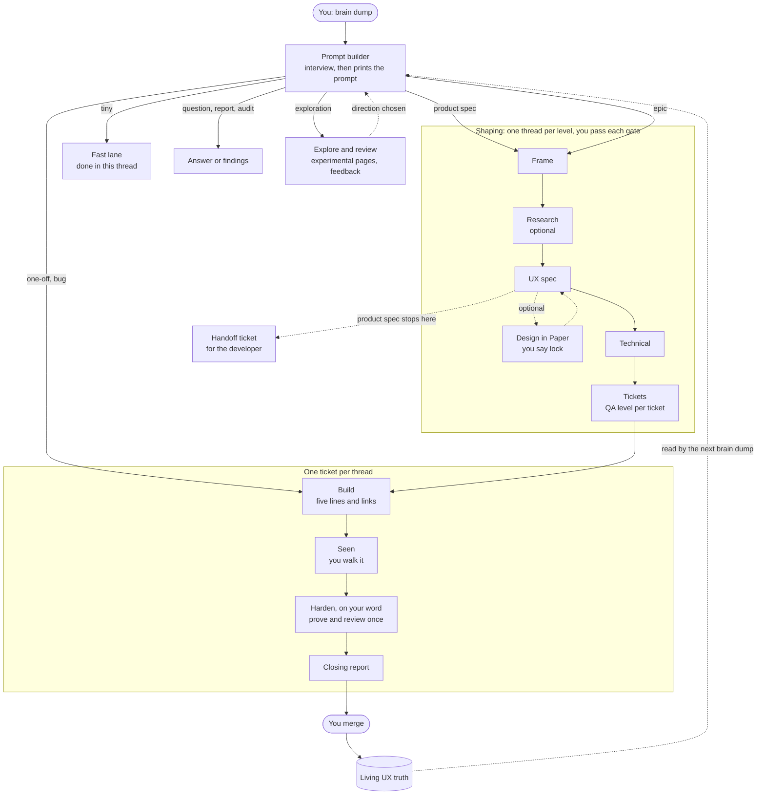

# How work moves

> **The whole thing in one breath.** Every piece of work starts at one front door: you describe it, the prompt builder asks what it needs to know once, and prints a prompt for a new thread. The track decides what happens next, the QA level decides how carefully it is checked, and the thread finishes on its own and tells you in a few lines what needs you.

## The game you're playing

Think of the repo as a game world with five systems.

| System          | Lives in                               | What it holds                                                               | Who changes it                           |
| --------------- | -------------------------------------- | --------------------------------------------------------------------------- | ---------------------------------------- |
| **Library**     | `docs/`                                | Everything we know: canon, references, conventions, templates, these workflows | People, through threads. Agents read it. |
| **Party**       | `docs/roles/`                          | The cast: Vesper (UX), Mason (CTO), Reeve (tickets), Vigil (QA) and more    | You confirm who plays                    |
| **Quest board** | `specs/`                               | The app's living UX truth, plus epics, tickets, explorations and audits     | Agents write; checks validate            |
| **World**       | `apps/`, `packages/`                   | The code                                                                    | Agents, in build threads                 |
| **Physics**     | `.claude/`, `tooling/`, `toolkit.json` | Settings, hooks, checks, path rules                                         | Fixed. Nobody negotiates with physics.   |

The idea behind the Physics: a rule written in markdown is a request, and a rule enforced by a check is a law. The Physics is kept for the things that must never go wrong (pushing, secrets, destructive commands, the design tokens, package boundaries). How much proof and review a piece of work gets is not physics: it is a choice, made at the front door.

## The front door

[`prompt-builder.md`](prompt-builder.md) is where everything starts.

- **It asks,** in rounds with options:
  - which track, which app, who is cast;
  - the QA level and reviewers, any part that needs a deeper look;
  - the pace, how involved you want to be, the branch;
  - whether to make a formal ticket, what you will attach;
  - the track's own questions.
- **It then prints** the prompt, a forecast of effort, time, cost, risk and your attention (estimates), and a block for each research thread the work needs.
- **Tiny work** takes the fast lane and is done on the spot.

## The tracks

Eight kinds of quest, each with its own path. Details and how to tell them apart: [`tracks/`](tracks/README.md).

| Track                                                    | In game terms                              |
| -------------------------------------------------------- | ------------------------------------------ |
| [Epic](tracks/epic.md)                                   | A campaign, played in levels               |
| [One-off](tracks/one-off.md)                             | A side quest                               |
| [Feature exploration](tracks/feature-exploration.md)     | Scouting ahead                             |
| [Product spec only](tracks/product-spec.md)              | Drawing the map for someone else           |
| [Bug or issue](tracks/bug.md)                            | Something is on fire, or smouldering       |
| [Question or report](tracks/question-report.md)          | Asking the oracle                          |
| [Audit](tracks/audit.md)                                 | Sweeping the dungeon before the crowd arrives |
| [New project](tracks/new-project.md)                     | Starting a new save file                   |

## The map



## QA levels

Four levels set proof, review and paperwork together; full detail in [`qa-levels.md`](qa-levels.md).

| Level | For                                             | In short                                                        |
| ----- | ----------------------------------------------- | --------------------------------------------------------------- |
| Q0    | Questions, reports, docs, trivial fixes         | Nothing extra                                                   |
| Q1    | Ordinary code                                   | The builder proves it; `yarn verify` once, at the close         |
| Q2    | Code worth a second look                        | Plus one fresh reviewer, findings in the thread                 |
| Q3    | Money, auth, schema, personal data, permissions | Recorded proofs, confirmed specialists, review files kept       |

The builder recommends, you confirm, each ticket carries its own, and you can ask for a deeper look at any named part at any time.

## Where everything lives

```
specs/
├─ _status.md                       generated: every ticket's state
└─ web/                             one folder per app
   ├─ ux/                           LIVING TRUTH: how the app works now
   │  ├─ _global/                   architecture, navigation, shell, app-wide decisions
   │  └─ onboarding/                one folder per area: overview.md, one file per surface
   ├─ epics/OB2-onboarding-v2/      a campaign
   │  ├─ brief.md                   problem, appetite, knowledge gaps
   │  ├─ research/                  notes from research threads
   │  ├─ ux/                        proposed changes, mirroring ux/ paths
   │  ├─ technical.md               only what every ticket shares
   │  └─ tickets/OB2-003-welcome-copy/ contract.md, results.json; as-built.md; at Q3 the reviews
   ├─ one-offs/WEB-041-fix-filter/  a side quest that chose a ticket
   ├─ explorations/<slug>/          brief.md, research/, findings.md
   ├─ audits/<date>-<slug>.md       saved findings
   ├─ reports/<date>-<slug>.md      only reports the operator chose to save
   └─ _archive/2026/10/             finished work, by the month it closed
```

Work that spans apps lives in `specs/_shared/` with the same shape. Nothing else is filed: no prompt files, no evidence logs, no review files below Q3. Ticket numbers in folder names are padded to three digits, so a folder lists in order; the id stays short (`OB2-3`).

**The archive.** Finished work leaves the live tree so it stays readable as tickets pile up.

- **What moves:** `yarn specs:archive` moves every closed one-off, and every epic whose tickets are all closed, into `_archive/<year>/<month>/` by the month it closed.
- **A preview:** `yarn specs:archive --dry-run` shows what would move and what is held back and why.
- **What stays put:** anything draft, open, closing or waiting on a migration, and any folder another thread has uncommitted changes in.
- **Nothing is lost:** `yarn status <id>` still finds an archived ticket, `_status.md` lists the archive by month, and a number or epic prefix in the archive is never handed out again.
- **When it runs:** you decide.

## Truth and records

- **Truth** (`specs/<app>/ux/`) always says how the app works now. It changes when an epic ships and its proposals are promoted, or when a one-off or a bug fix edits it in the same change as the code.
- **Records** (everything else under `specs/`) say what we intended, what we built and what we found. They are kept as light as the work's QA level allows.

## Your HUD

HUD is "heads-up display", from games: what the system shows you without being asked.

| When                               | What appears                                                   |
| ---------------------------------- | -------------------------------------------------------------- |
| Opening a session                  | One short status line: active work and what is next            |
| An agent tries something forbidden | A denial that names the right move                             |
| A session that changed files stops | A quick check of its own files, then "Left to go"              |
| A thread finishes                  | The closing report: six lines at most, led by what needs you   |

## Explain it back (30 seconds)

> "Everything starts at the prompt builder. I describe the work, it asks me its questions once (which track, who plays, how carefully to check it, how involved I want to be, which branch) and prints a prompt and a forecast. I paste the prompt into a new thread. Small things just get built and proven; critical things get recorded proofs and specialist reviewers; epics go through levels and give every ticket its own QA level. Each thread finishes on its own and tells me in a few lines what needs me."

## Go deeper

- [`prompt-builder.md`](prompt-builder.md): the front door. [`prompt-standard.md`](prompt-standard.md): what every printed prompt carries.
- [`tracks/`](tracks/README.md): one file per track. [`stages/`](stages/README.md): the stages tracks share.
- [`qa-levels.md`](qa-levels.md): the levels, focus, and the finding flags. [`branches.md`](branches.md): branches in plain language.
- [`glossary.md`](glossary.md): every term in one line.

<!-- Generated by `yarn directory-map` from each file's frontmatter. Everything below this line is rewritten; edit above it. -->

## In this folder

| File | What it is for |
| --- | --- |
| [`branches.md`](branches.md) | Read when the prompt builder asks whether work should stay on the current branch or get its own, or when someone who does not write code needs to know what a branch, a pull request and a merge mean here. |
| [`glossary.md`](glossary.md) | Read when a term in the workflows, a stage file or a hook message is unfamiliar; one line per term, plus old words from the previous spec system mapped to new ones. |
| [`prompt-builder.md`](prompt-builder.md) | Attach, or run as /tk-prompt, whenever work is about to start: it interviews the operator, settles the track, the cast, the QA level, the pace, the involvement and the branch, then prints the prompt, what to expect, and any research prompts. It saves nothing. |
| [`prompt-standard.md`](prompt-standard.md) | Read before writing or checking any prompt that opens a thread, by the prompt builder, a stage file or a person: the checklist a prompt must pass, the forecast printed with it, and the kickoff block for build threads. |
| [`qa-levels.md`](qa-levels.md) | Read when choosing or changing how carefully a ticket, a stage or one named part of the work is checked: the four levels, what each costs, who picks the reviewers, and how an operator asks for more on demand. |
| [`stages/`](stages/README.md) | Open to see the seven stage files an epic's levels run on, and the one a one-off runs on: each names its cast, venue, loads, interview rounds, writes, gate and handoff. |
| [`templates/`](templates/README.md) | Open when a Research thread needs the note template; the UX and technical templates live with their layers (docs/design/templates/, docs/engineering/templates/). |
| [`tracks/`](tracks/README.md) | Open to see the kinds of work the prompt builder routes to and how to tell them apart: each track file names when it applies, its stages, cast, default QA level, what it writes, its interview questions and how it ends. |
